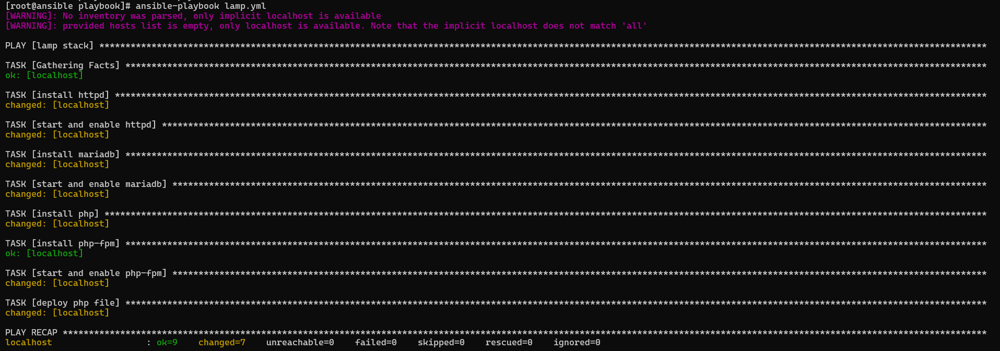
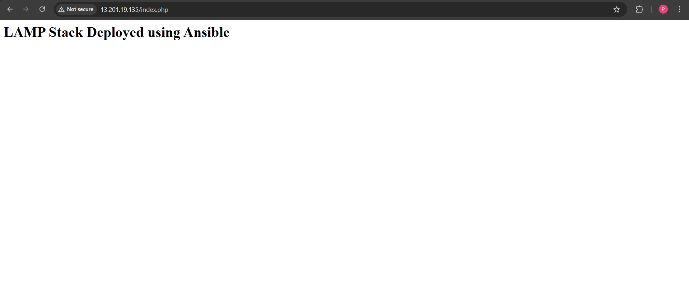
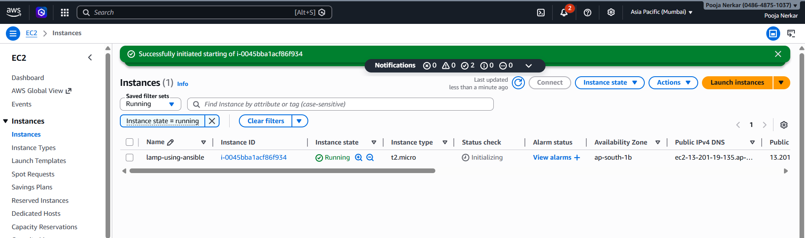

# LAMP Stack Deployment using Ansible

## 📌 Overview
This project demonstrates the installation and configuration of a LAMP stack (Linux, Apache, MariaDB, PHP) using Ansible on an AWS EC2 instance.

## 🛠️ Tools Used
- Ansible
- AWS EC2 (Amazon Linux)
- Linux

## ⚙️ What I Did
- Launched an EC2 instance on AWS
- Installed Ansible on the server
- Created an Ansible playbook to automate:
  - Apache (httpd) installation and setup
  - MariaDB installation and startup
  - PHP and PHP-FPM installation
- Deployed a PHP test page using Ansible

## 🚀 Playbook Features
- Uses `dnf` module for package installation
- Uses `systemd` and `service` modules to manage services
- Automates full LAMP stack setup
- Deploys a working web application page

## 🌐 Output
After running the playbook, the web server displays:

LAMP Stack Deployed using Ansible

## 📸 Screenshots

### Ansible Playbook Execution

### Web Application Output

### AWS EC2 Instance

## 💡 Key Learning
- Hands-on experience with Ansible playbooks
- Automated server configuration
- Basic understanding of service management in Linux
